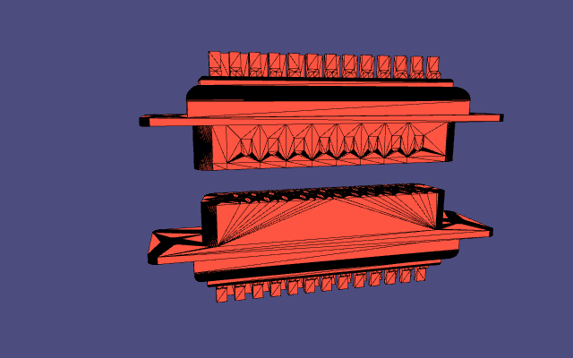
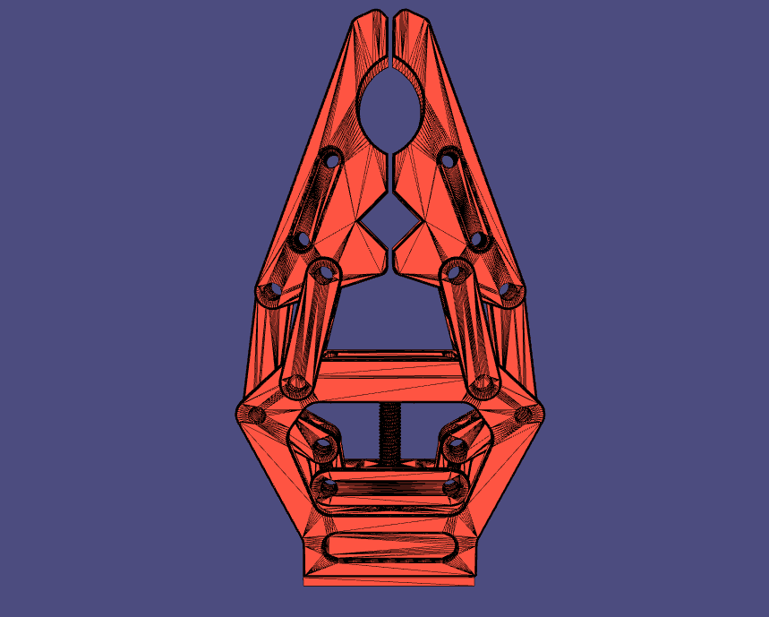
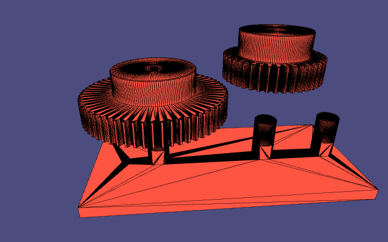
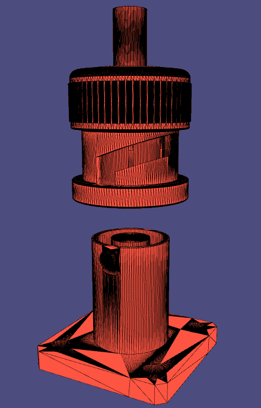
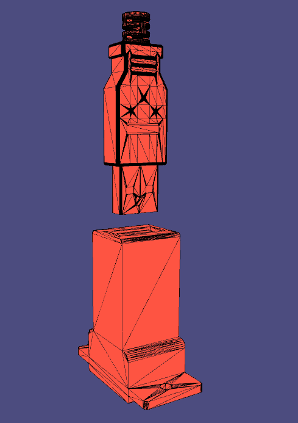
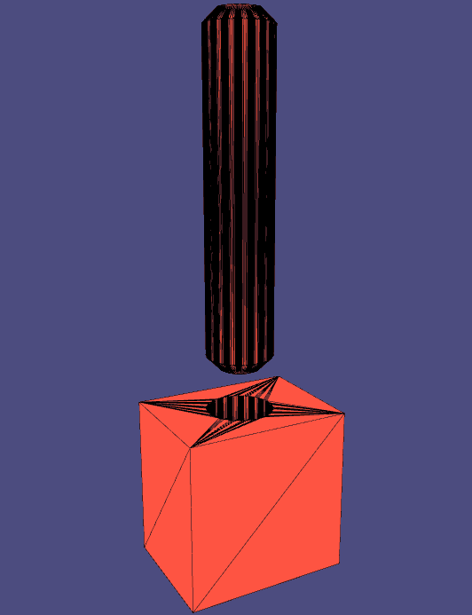
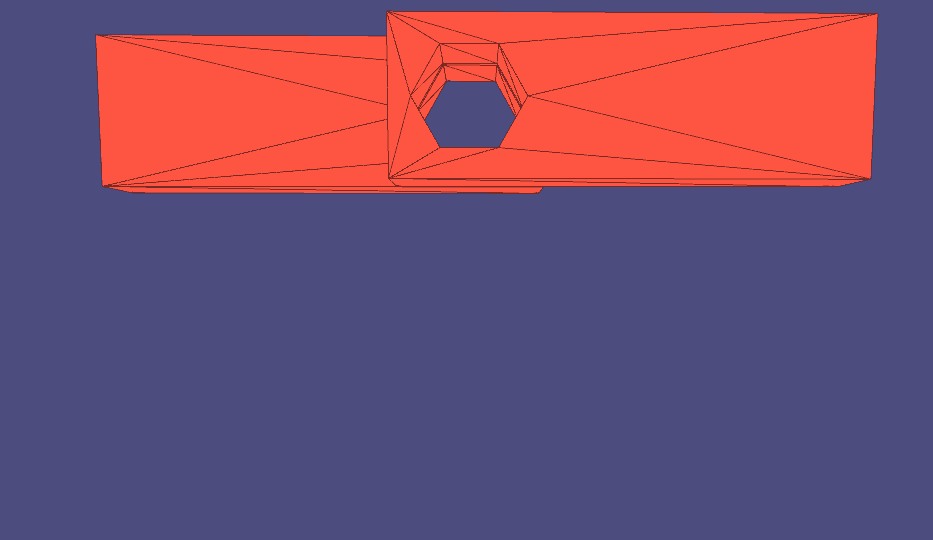
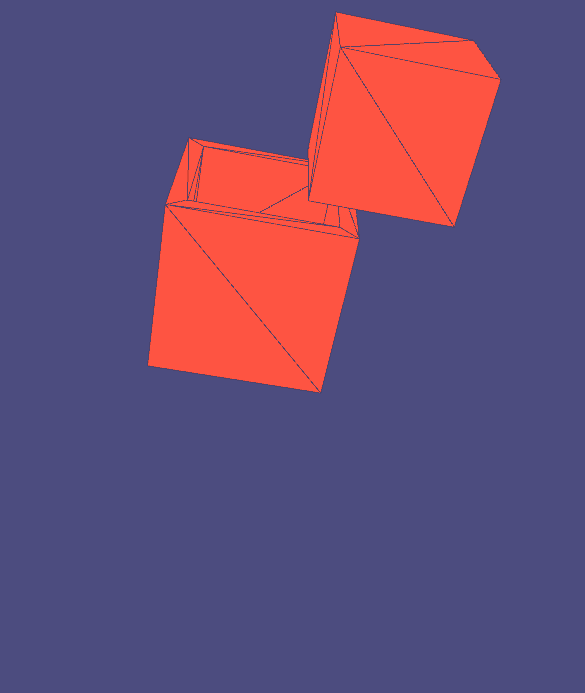
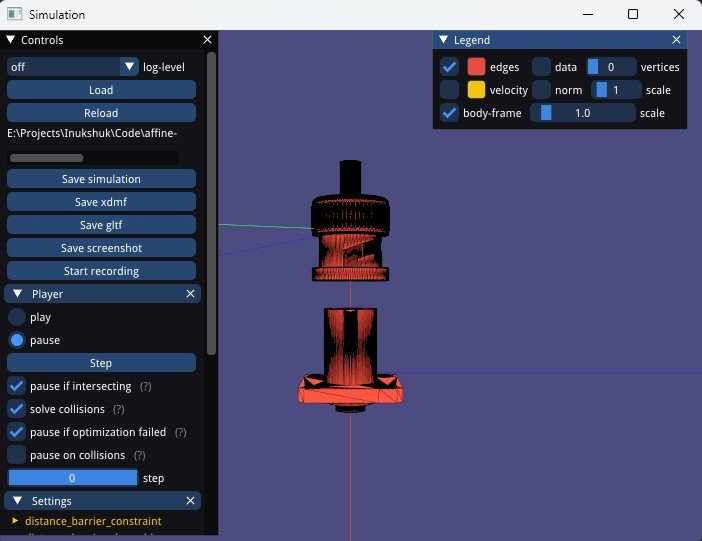

# Affine Body Dynamics

## Fast, robust, accurate, intersection-free rigid body simulations with contact forces and joint constraints based on [Affine Body Dynamics](https://dl.acm.org/doi/abs/10.1145/3528223.3530064)


| [DSUB - 25pin](inputs/dsub_25pin/dsub.json)                   | [Gripper](inputs/gripper/gripper_with_screw_torque.json)
:--------------------------------------------------------------:|:-----------------------------------------------:
              |  

| [Gear assembly](inputs/gear_assembly_offset/gear_offset.json) | [BNC](inputs/bnc_crimp/bnc.json)
:--------------------------------------------------------------:|:-----------------------------------------------:
  |  

| [Nut and Bolt](inputs/m16/m16.json)                           | [Slope](inputs/slope/slope.json)
:--------------------------------------------------------------:|:------------------------------------------------------:
                      | 

| [USB](inputs/usb_test_01/usb.json)                            | [Peg Insertion](inputs/peg/peg_insertion.json)
:--------------------------------------------------------------:|:------------------------------------------------------:
          |  

| [Pendulum](inputs/simple_joint/simple_joint.json)             | [Failing Cube](inputs/cube_drop/cube_drop.json)
:--------------------------------------------------------------:|:------------------------------------------------------:
    |  

## Comparisons 
Comparisons between Rigid IPC and Affine Body Dynamics can be found under [ABD Vs. RigidIPC](/inputs/ABD%20Vs.%20RigidIPC.md)

## Build

WARNING: The build process will automatically download the dependencies listed in the [Dependencies](#dependencies) section below. Please make sure to check their associated licenses to ensure compliance.

To build the project, use the following commands from the root directory of the project:

```bash
mkdir build
cd build
cmake -DCMAKE_BUILD_TYPE=Release ..
```

Depending on the system, this will generate either a `.sln` project on Windows or a `make` file for a Linux system.


The following flags might be needed for cmake 

```bash
cmake -DCMAKE_BUILD_TYPE=Release -DCMAKE_CUDA_ARCHITECTURES=75 ..
```

## Usage

### Scenes

We take as input a single JSON file that specifies the mesh and initial conditions for each body. The `inputs` directory contains example scenes.

The BNC scene above for instance uses the JSON file `inputs/bnc_crimp/bnc.json`.

### Running the simulation

To start the tool, run the following command:

```bash
abd_sim.exe --scene-path /project_dir/inputs/bnc_crimp/bnc.json
```
For the full list of options, run:

```bash
abd_sim.exe --help
```
By default, a GUI will be launched as shown below:



You can then click the play radio button to start the simulation.

## Dependencies

**All dependancies are downloaded through CMake** depending on the build options.
The following libraries are used in this project:

* [IPC Toolkit](https://github.com/ipc-sim/ipc-toolkit): common IPC functions
* [Eigen](https://eigen.tuxfamily.org/): linear algebra
* [libigl](https://github.com/libigl/libigl): basic geometry functions, predicates, and viewer
* [TBB](https://github.com/wjakob/tbb): parallelization
* [Tight Inclusion CCD](https://github.com/Continuous-Collision-Detection/Tight-Inclusion): correct (conservative) continuous collision detection between triangle meshes in 3D
* [spdlog](https://github.com/gabime/spdlog): logging information
* [filib](https://github.com/txstc55/filib): interval arithmetic
* [Niels Lohmann's JSON](https://github.com/nlohmann/json): parsing input JSON scenes
* [tinygltf](https://github.com/syoyo/tinygltf.git): exporting simulation animation to GLTF format
* [finite-diff](https://github.com/zfergus/finite-diff): finite difference comparisons
    * Only used by the unit tests and when `ABD_WITH_DERIVATIVE_CHECK=ON`

#### Optional

* [Catch2](https://github.com/catchorg/Catch2.git): unit tests

## Acknowledgments

This is an implementation of the [Affine Body Dynamics](https://dl.acm.org/doi/abs/10.1145/3528223.3530064) method as described and developed by Lei Lan et al. And the code is based on the [Rigid IPC](https://github.com/ipc-sim/rigid-ipc) implementation by Zachary Ferguson et al.

- Lan, L., Kaufman, D. M., Li, M., Jiang, C., & Yang, Y. (2022). Affine body dynamics: Fast, stable & intersection-free simulation of stiff materials. arXiv preprint arXiv:2201.10022.

- Ferguson, Z., Li, M., Schneider, T., Gil-Ureta, F., Langlois, T., Jiang, C. & Panozzo, D. (2021). Intersection-free rigid body dynamics. ACM Transactions on Graphics, 40(4).
